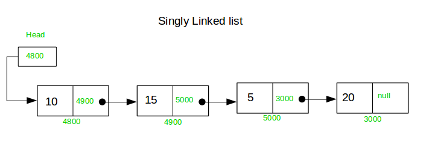

# 📚 Singly Linked List Implementation

A **Singly Linked List** is a linear data structure where each element (node) contains:
- **data** → the value stored
- **next** → reference to the next node in the list  

The last node points to `null`.

---

## 📘 Steps Involved in Implementing Singly Linked List

### 1. Create a Node Structure
- Each node consists of:
  - An integer `data`
  - A reference `next` pointing to the next node
- If a node is the last element, its `next` is `null`.

---

### 2. Convert Array to Linked List (`convertArr2LL`)
- Create the head node using the first element of the array.
- Use a pointer to track the last node.
- Traverse the array and:
  - Create a new node for each element
  - Link it to the previous node
- Return the head of the linked list.

---

### 3. Print Linked List (`printLL`)
- Start from the head node.
- Traverse the list until `null` is reached.
- Print the `data` of each node.

---

### 4. Find Length of Linked List (`lengthOfLL`)
- Initialize a counter to `0`.
- Traverse the list node by node.
- Increment the counter for each node.
- Return the total count.

---

### 5. Search an Element (`checkIfPresent`)
- Traverse the linked list from head.
- Compare each node’s data with the target value.
- Return `true` if found, otherwise return `false`.

---

### 6. Remove Head Node (`removesHead`)
- If the list is empty, return `null`.
- Move the head pointer to the next node.
- Return the new head.

---

### 7. Remove Tail Node (`removesTail`)
- If the list is empty or has only one node, return the head.
- Traverse until the second-last node.
- Set its `next` to `null`.
- Return the head.

---

### 8. Remove K-th Node (`removeK`)
- If the list is empty, return the head.
- If `k == 1`, remove the head node.
- Traverse the list while counting nodes.
- When the count reaches `k`, adjust pointers to skip that node.
- Return the head.

---

### 9. Remove a Given Element (`removeElement`)
- If the list is empty, return the head.
- If the head node contains the element, remove it.
- Traverse the list and:
  - When the element is found, skip that node
- Return the head.

---

### 10. Insert at Head (`insertHead`)
- Create a new node with the given value.
- Point the new node’s `next` to the current head.
- Return the new node as the head.

---

### 11. Insert at Tail (`insertTail`)
- If the list is empty, create and return a new node.
- Traverse to the last node.
- Create a new node and attach it to the last node.
- Return the head.

---

### 12. Insert at a Given Position (`insertPosition`)
- If the list is empty:
  - Insert only if position is `1`
- If position is `1`, insert at head.
- Traverse until position `k-1`.
- Insert the new node by adjusting pointers.
- Return the head.

---

### 13. Insert Before a Given Value (`insertBeforeValue`)
- If the list is empty, return `null`.
- If the head node contains the target value:
  - Insert at head
- Traverse the list:
  - When the next node contains the target value, insert before it
- Return the head.

---

## 🧠 Key Characteristics
- Dynamic size (no fixed capacity)
- Efficient insertion and deletion
