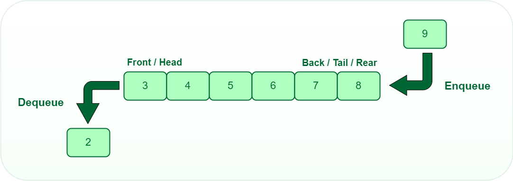

# 📚 Queue Implementation Using Array (Circular Queue)

A **Queue** is a linear data structure that follows the **FIFO (First In, First Out)** principle.  
In this implementation, the queue is implemented using a **fixed-size array** with **circular indexing** to efficiently utilize space.

---

## 📘 Steps Involved in Implementing Queue Using Array

### 1. Declare an Array of a Particular Size
- Declare an array to store the elements of the queue.
- The size of this array is determined when the queue is initialized.

---

### 2. Define Variables
- **front**: Tracks the index of the front element.
- **rear**: Tracks the index of the last element.
- **size**: Keeps the current number of elements in the queue.
- **capacity**: The maximum number of elements the queue can hold.

---

### 3. Push Operation (`push(int x)`)
Used to insert an element into the queue.

**Steps:**
1. Check if the queue is full by comparing `size` with `capacity`.
   - If `size == capacity`, the queue is full.
2. If the queue is not full:
   - Increment `rear` using modular arithmetic:  
     `rear = (rear + 1) % capacity`
   - Insert the element at `array[rear]`.
   - Increment `size` by 1.

---

### 4. Pop Operation (`pop()`)
Used to remove and return the front element from the queue.

**Steps:**
1. Check if the queue is empty by comparing `size` with `0`.
   - If `size == 0`, the queue is empty.
2. If the queue is not empty:
   - Retrieve the element at `array[front]`.
   - Increment `front` using modular arithmetic:  
     `front = (front + 1) % capacity`
   - Decrement `size` by 1.
   - Return the retrieved element.

---

### 5. Peek Operation (`peek()`)
Used to view the front element without removing it.

**Steps:**
1. Check if the queue is empty.
2. If the queue is not empty:
   - Return the element at `array[front]`.

---

### 6. IsEmpty Operation (`isEmpty()`)
Used to check whether the queue is empty.

**Logic:**
`size == 0`

---

### 7. Print Queue Operation (`printQueue()`)
Used to print all elements of the queue.

**Steps:**
1. Check if the queue is empty.
   - If empty, display a message.
2. If not empty:
   - Start from the `front` index.
   - Traverse `size` elements using circular indexing.
   - Print each element.