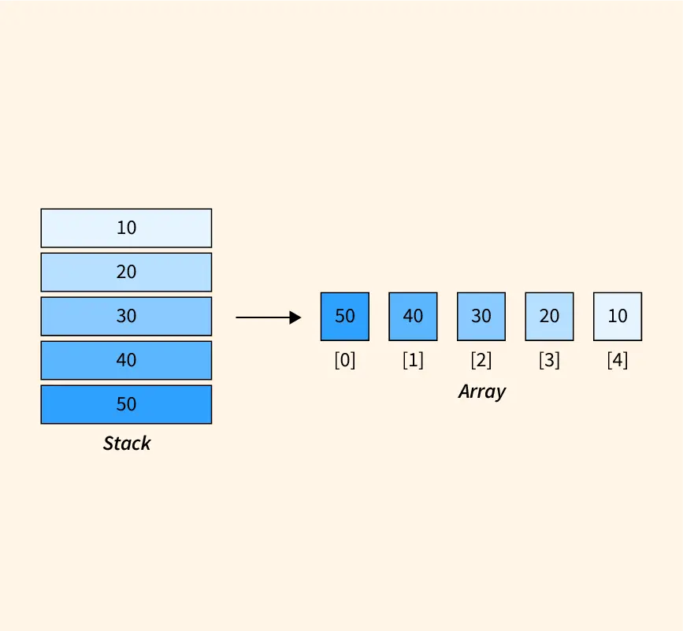

# 📚 Stack Implementation Using Array

A **Stack** is a linear data structure that follows the **LIFO (Last In, First Out)** principle.  
In this implementation, the stack is created using a **fixed-size array**.

---

## 📘 Steps Involved in Implementing Stack Using Array

### 1. Declare an Array of Particular Size
- Initialize an array that will hold the elements of the stack.
- The size of the array is defined when the stack is created.

---

### 2. Define a Variable **Top** and Initialize It as **-1**
- The variable `top` keeps track of the index of the last added element in the stack.
- Initializing `top` to `-1` indicates that the stack is empty.

---

### 3. Push Operation (`push(int x)`)
To push an element onto the stack:
- Increment the `top` index by one.
- Insert the element at this position in the array.
- If the stack is full (`top` is equal to the last index of the array), throw a **Stack Overflow** exception.

---

### 4. Pop Operation (`pop()`)
To pop an element from the stack:
- Check if the stack is not empty by ensuring `top` is not equal to `-1`.
- If the stack is empty, throw a **Stack Underflow** exception.
- If the stack is not empty:
  - Return the element at the `top` index.
  - Decrement the `top` index by one.

---

### 5. Top Operation (`top()`)
To get the top element without removing it:
- Check if the stack is not empty.
- If it is empty, throw an exception.
- If the stack is not empty, return the element at the `top` index.

---

### 6. IsEmpty Operation (`isEmpty()`)
To check if the stack is empty:
- Check if the `top` index is `-1`.

---

### 7. Size Operation (`size()`)
To get the current size of the stack:
- Return `top + 1`.

### 8. Print Stack Operation (`printStack()`)
To print all elements of the stack:
- Check if the stack is empty.
- If the stack is empty, display a message indicating that the stack is empty.
- If the stack is not empty:
  - Traverse the array from the `top` index to `0`.
  - Print each element.
